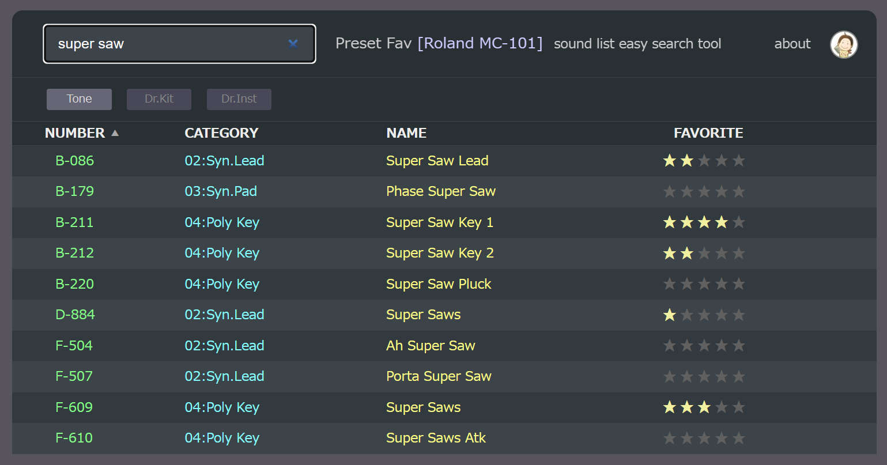

PresetFav
---
A simple web app to rate your favorite synthesizer presets.

## Features
- Display a list of synth presets
- Filter presets by keyword
- Sort presets by number, category, name and favorite
- Rate each preset from 0 to 5 stars with X account login
- Export your favorite data
- Now supports 5 synths: Roland MC-101, JD-Xi, SH-32, JD-800 and Novation MiniNova

## Webpage
https://aike.github.io/PresetFav/

## Screenshot

## License
PresetFav program is licensed under MIT License.  
Copyright 2025, aike (@aike1000)  
